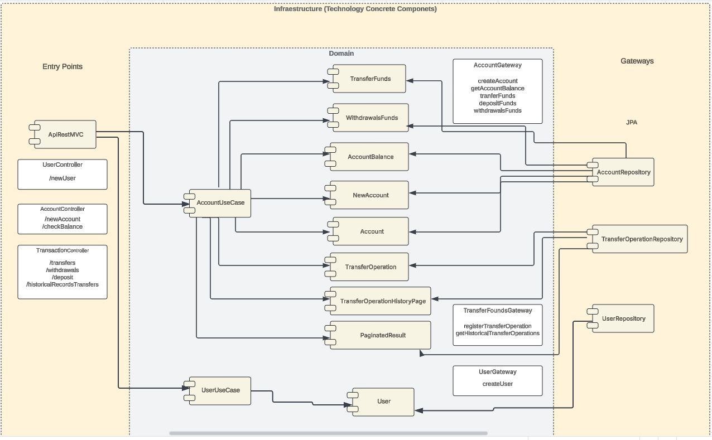
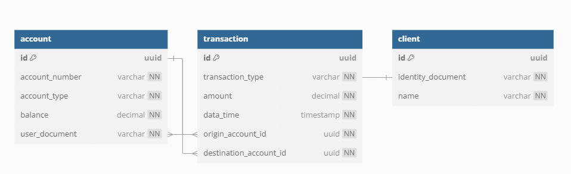

# Proyecto Banck Account - prueba técnica Nivel 1 Bancolombia  
## Desarrolladora - Laura Vanesa Tascón Cataño - Ing se sistemas

> [!NOTE]
> Este es un proyecto creado para una prueba técnica

## Resumen
El sistema de gestión de cuentas bancarias permite administrar y operar cuentas de manera segura, garantizando 
la integridad de las transacciones. Cada cuenta bancaria tiene un saldo asociado y solo puede realizar operaciones si dispone de 
fondos suficientes. Para ello, se ha diseñado una API REST que expone endpoints para la creación de cuentas, 
consulta de saldo, depósitos, retiros y consulta del historial de transacciones y la creación de clientes asiciados.

La solución sigue una arquitectura limpia, asegurando la separación de responsabilidades y la independencia de 
los detalles de infraestructura. Esto permite mantener un código modular, escalable y fácil de probar, garantizando 
que la lógica de negocio se mantenga pura y desacoplada de la tecnología utilizada.

## Objetivos del proyecto ✨
Desarrollar una API REST que permita la gestión eficiente y segura de cuentas bancarias, garantizando la integridad de las transacciones y el acceso controlado a la información.

Los objetivos específicos de la API incluyen:

✅ Administrar cuentas bancarias, permitiendo su creación y consulta. 

✅ Consultar el saldo disponible de una cuenta en cualquier momento.

✅ Realizar depósitos y retiros, asegurando que los retiros solo se procesen si hay fondos suficientes.

✅ Registrar y consultar el historial de transacciones de cada cuenta.

✅ Proporcionar respuestas claras y estandarizadas, manejando errores de forma adecuada.

✅ Exponer endpoints REST con una estructura clara y siguiendo buenas prácticas de diseño de API.

## Arquitectura
Este proyecto se costruye usando arquitectura limpia mediante el patron o arquitectura
creada por Bancolombia llamado Scaffold, este modelo de arquitectura es un tipo especifico
de arquitectura hexagonal dado que delimita las funciones y responsabilidades de forma clara 
y eficiente.

Siguiendo los principios de arquitectura limpia, el código se estructura en capas bien definidas:

🔹 Dominio: Contiene las reglas de negocio puras.

🔹 Aplicación: Orquesta los casos de uso sin depender de detalles externos.

🔹 Infraestructura: Implementa adaptadores para interactuar con bases de datos, controladores y servicios externos.

**documentación** https://bancolombia.github.io/scaffold-clean-architecture/docs/intro

## Diagram Entidad-Relación (DB)

## 🚨 Códigos de errores 🚨
La API utiliza códigos de error propios para el manejo de excepciones con el objetivo de proporcionar respuestas 
más claras y estructuradas. Aunque se emplean códigos de estado HTTP estándar, los códigos internos permiten identificar con precisión la causa del error, facilitando la depuración y la interpretación por parte de los clientes de la API. Esto asegura una gestión más eficiente de 
los errores y una mejor experiencia para los desarrolladores que integren el servicio.

| Código de Error | Descripción del Error | HTTP Status |
|---------------|----------------------|-------------|
| BC-B000 | ERROR QUERY, DOES NOT EXIST OR IS NOT AVAILABLE | 404 Not Found |
| BC-B01 | FORMAT ERROR | 400 Bad Request |
| BC-B02 | REQUIRED FIELD ERROR | 400 Bad Request |
| BC-B03 | INSUFFICIENT FUNDS IN ACCOUNT | 400 Bad Request |
| BR-I00 | INTERNAL API ERROR | 500 Internal Server Error |
| BR-002 | JSON FORMAT ERROR | 400 Bad Request |

## ⚠️ Matriz de Errores ⚠️
La Matriz de Errores define los distintos códigos de error que puede devolver la API, 
proporcionando una referencia clara sobre el motivo de cada fallo. Cada error incluye un código único, 
un título descriptivo, un detalle sobre la causa del error y una explicación del porqué ocurre. 
Esto permite una gestión eficiente de excepciones y facilita la depuración e integración con otros sistemas.

| Código de Error | HTTP Status (code) | Título | Detalle | Descripción / Por qué sucede |
|---------------|------------------|--------|---------|-------------------------------|
| BC-B03 | 400 Bad Request | INSUFFICIENT FUNDS | Insufficient funds in account {accountNumber} | Ocurre cuando se intenta realizar una transacción, pero no hay saldo suficiente en la cuenta. |
| BC-B000 | 404 Not Found | ACCOUNT NOT FOUND | Account does not exist | Se busca una cuenta por número de cuenta, pero esta no existe. |
| BC-B000 | 404 Not Found | DESTINATION ACCOUNT NOT FOUND | Destination account does not exist | La cuenta a la que se quiere enviar dinero no existe. |
| BC-B000 | 404 Not Found | ORIGIN ACCOUNT NOT FOUND | Origin account does not exist | La cuenta desde la que se quiere enviar dinero no existe. |
| BC-B000 | 409 Conflict | ACCOUNT ALREADY EXISTS | Account already exists | Se intenta crear una cuenta que ya existe. |
| BC-B000 | 404 Not Found | USER NOT FOUND | User not found | Se intenta ligar una cuenta a un usuario que no existe. |
| BC-B000 | 409 Conflict | USER ALREADY EXISTS | User already exists | Se intenta registrar un usuario que ya está registrado. |
| BC-B01 | 400 Bad Request | INVALID PAGE SIZE | Page size must be greater than zero | Ocurre cuando el tamaño de la página es menor o igual a cero. |
| BC-B01 | 400 Bad Request | INVALID PAGE INDEX | Page index must be zero or greater | Ocurre cuando el índice de la página es menor que cero. |
| BC-B01 | 400 Bad Request | INSUFFICIENT BALANCE | Initial balance cannot be less than {MINIMUM_BALANCE} | No es posible realizar una transacción debido a un saldo insuficiente en la cuenta. |

## Swagger
La documentación de la API está disponible en formato Swagger. Puedes encontrar de manera online en:
https://editor.swagger.io/
La documentación de la API está disponible en formato Swagger. Puedes encontrar el archivo YAML en la siguiente ubicación:
[Ver Swagger YAML](utils/swagger.yaml)

## Base de Datos H2
Para ejecutar el proyecto, no se requiere configuración adicional de base de datos. Basta con clonar el repositorio, abrirlo en un entorno como IntelliJ IDEA y ejecutarlo.

La API utiliza H2 en memoria, lo que significa que la base de datos se carga en caché durante la ejecución del proyecto. Si bien esta solución tiene limitaciones en persistencia y concurrencia, ofrece una ventaja clave en este tipo de proyectos (pruebas técnicas), ya que permite a los evaluadores ejecutar y probar la API fácilmente, sin necesidad de configurar un entorno de base de datos externo.

Es importante tener en cuenta que, debido a la naturaleza volátil de H2 en memoria, todos los datos se perderán cada vez que el proyecto se vuelva a ejecutar o reconstruir. 🚀
